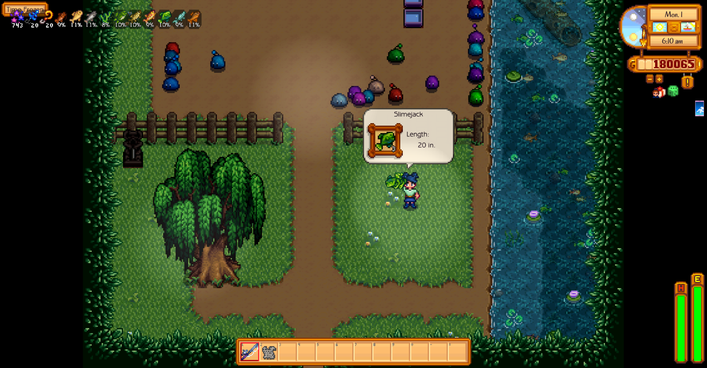
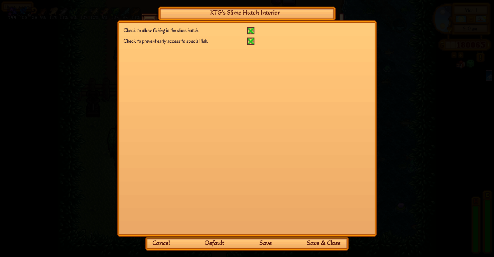

# 	

I got bored with the regular slime hutch interior, and going in there feels like a chore to me, so I made this to make the interior more fun. 

This map provides more room in the Slime Hutch, an auto-fenced area where you can corral your slimes, and fishing that matches the town and the mountain area fishing, plus Slimejacks and Midnight Carp felt appropriate.



# 

You must have [Content Patcher](https://www.nexusmods.com/stardewvalley/mods/1915) v 2.7 or later installed for this map to properly load. This is a content pack for Content Patcher. 

# 

SMAPI will generate a config file that looks like the below. I suggest using [GMCM](https://www.nexusmods.com/stardewvalley/mods/5098) to allow managing the options in game.

```
{
  "EnableFishing": "true",
  "NoSpoilers": "true"
}
```

`EnableFishing` can take either `true` or `false` values. `True` lets you fish in the stream inside the Slime Hutch. `False` disables fishing in the Slime Hutch. 

`EnableFishing` has to be set to `true` for the `NoSpoilers` option to have any affect. It, likewise, takes either `true` or `false` values, and when `true` limits fishing to just the fish that are can be fished up in the Town or the Mountain map **until** the current player visits the map where Slime Jacks spawn. When `false` and `EnableFishing` is `true`, Slime Jacks can be fished up at all times, and Midnight Carp can be caught even in Spring or Summer, though still only between 10 PM and 2 AM.



# 

This mod only changes the interior layout map of the Slime Hutch, which does involve an update to Data/Buildings/Slime Hutch to get the Slime Incubator to spawn in a different location. It uses base game assets, so if you're using a recolor mod like [Vibrant Pastoral Redrawn](https://www.nexusmods.com/stardewvalley/mods/6367) those changes will affect the look of this map. 

This mod will conflict with any other mod that replaces the Slime Hutch interior. 

# 

The only thing to translate is the GMCM config menu.

| Language | File | Thank You, |
| -------- | ---- | ---------- |
| English | default.json | KasualTheGamer |
| Chinese (Simplified) | zh.json | [Google Translate][GT] |
| French | fr.json | [Google Translate][GT] |
| German | de.json | [Google Translate][GT] |
| Hungarian | hu.json | [Google Translate][GT] |
| Italian | it.json | [Google Translate][GT] |
| Japanese | ja.json | [Google Translate][GT] |
| Korean | ko.json | [Google Translate][GT] |
| Portuguese | pt.json | [Google Translate][GT] |
| Russian | ru.json | [Google Translate][GT] |
| Spanish | es.json | [Google Translate][GT] |
| Turkish | tr.json | [Google Translate][GT] |

[GT]: https://translate.google.com/

# 

A quirk is something that isn't going to get changed any time soon, and doesn't break the game. 

- Have not yet figured out how to move the water troughs >.<
- Slime balls spawn on the little cliffy, as well as the dirt zone. 

# 

These would be problems I'm actively working to fix.

- No known issues at this time.

# 

A big thanks to bblueberry on the SDV Discord modders chat for help getting the fishing to work, and to Selph (same venue) for help figuring out how to get the slime incubator to load properly!

# 

- [Generic Mod Config Menu](https://www.nexusmods.com/stardewvalley/mods/5098)
- [Visible Fish](https://www.nexusmods.com/stardewvalley/mods/8897)
- [Happy Fish Jump](https://www.nexusmods.com/stardewvalley/mods/6516)
- [Fishing Info Overlays](https://www.nexusmods.com/stardewvalley/mods/8970)

# 

Beta versions of this mod will be on [GitHub](https://github.com/KasualTheGamer/SDV-Slime-Hutch-Interior). 

If you think you can do better than me, you're probably right. I did not create any assets for this mod, so there's nothing for me to get flaffed over someone using. Have fun, and send me a link to what you make, please.